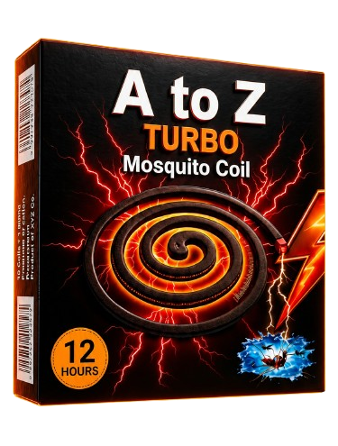
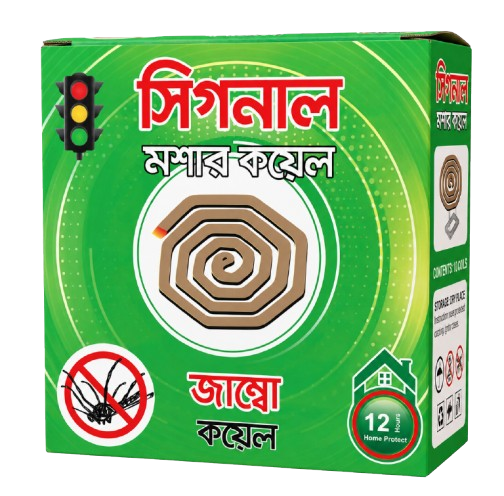
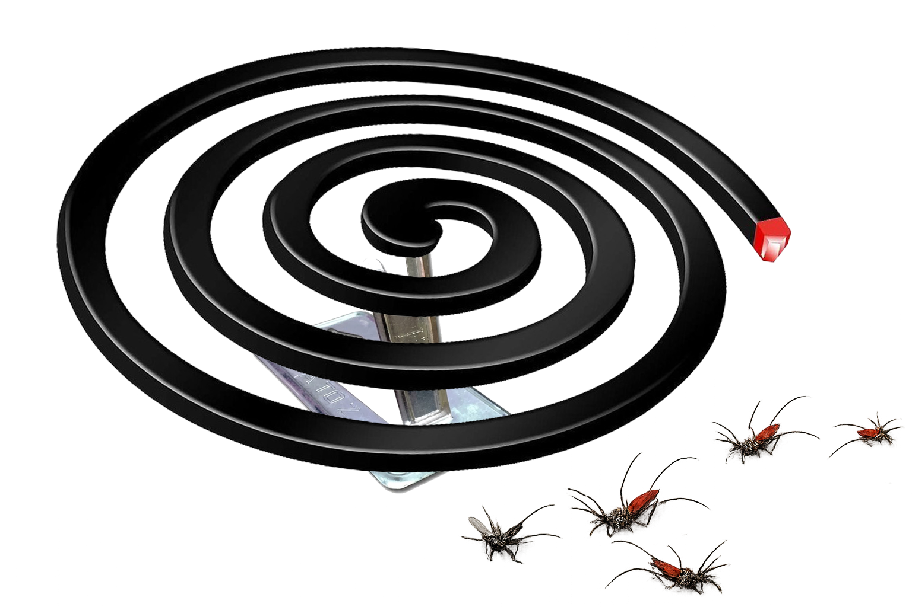

# A TO Z & SIGNAL Website — Version History

This is the single version-history file for the project.

Going forward, new update notes should be appended inside this same file instead of creating separate `Vxx_*.md` files.

## Version Index

- [v7 — Hero Fixed Full Code](#v7-hero-fixed-full-code)
- [v8 — Product Auto Selection](#v8-product-auto-selection)
- [v9 — Product Auto Select + Popup Details](#v9-product-auto-select-popup-details)
- [v10 — Premium Float + Growth Timeline](#v10-premium-float-growth-timeline)
- [v12 — Milestone + Brand Redesign](#v12-milestone-brand-redesign)
- [v13 — Smooth Loader + Anti-Blink + Adaptive Performance Fix](#v13-smooth-loader-anti-blink-adaptive-performance-fix)
- [v14 — Content, Brand Highlight & Floating Refinement](#v14-content-brand-highlight-floating-refinement)
- [v15 — Mobile, Map, CTA & Product Detail Refinement](#v15-mobile-map-cta-product-detail-refinement)
- [v16 — Section Refinement](#v16-section-refinement)
- [v17 — Smoke, Blog Pages & Section Reorder](#v17-smoke-blog-pages-section-reorder)
- [v18 — Office Location + About Leadership Update](#v18-office-location-about-leadership-update)
- [v19 — Smoke + Headline Spacing Refinement](#v19-smoke-headline-spacing-refinement)
- [v20 — Real Logo Replacement](#v20-real-logo-replacement)
- [v21 — Light Mode + Bangla Typography Refinement](#v21-light-mode-bangla-typography-refinement)
- [v22 — Growth + Brand Story Refinement](#v22-growth-brand-story-refinement)
- [v23 — Growth Desktop Layout Hotfix](#v23-growth-desktop-layout-hotfix)
- [v24 — Admin Dashboard & Responsive Control Panel](#v24-admin-dashboard-responsive-control-panel)
- [v25 — Experience Mini Coil + Mosquito Attack](#v25-experience-mini-coil-mosquito-attack)
- [v26 — Bangla Spacing + Mobile Panel Upgrade](#v26-bangla-spacing-mobile-panel-upgrade)
- [v27 — Desktop Bangla Nav Grid Fix](#v27-desktop-bangla-nav-grid-fix)
- [v28 — About Blog Admin Profile Upgrade](#v28-about-blog-admin-profile-upgrade)
- [v29 — About Us Layout Polish + Admin Dashboard Sidebar Upgrade](#v29-about-us-layout-polish-admin-dashboard-sidebar-upgrade)
- [v30 — Phase 1 Business Operations Upgrade](#v30-phase-1-business-operations-upgrade)
- [v31 — Phase 2 CMS Foundation + Phase 1 Polish](#v31-phase-2-cms-foundation-phase-1-polish)
- [v32 — Phase 3 Product System + About Us Stabilization](#v32-phase-3-product-system-about-us-stabilization)
- [v33 — Phase 4 Blog / Archive System + Responsive Stabilization](#v33-phase-4-blog-archive-system-responsive-stabilization)
- [v34 — About Blog Header UX Cleanup](#v34-about-blog-header-ux-cleanup)
- [v35 — About Visual, Timeline Button and Brand Battle Crop Fix](#v35-about-visual-timeline-button-and-brand-battle-crop-fix)
- [v36 — About Hero/Timeline Fix + Phase 5 SEO & Marketing Foundation](#v36-about-herotimeline-fix-phase-5-seo-marketing-foundation)
- [v37 — Phase 6 Security Maintenance + Story About Timeline Final Polish](#v37-phase-6-security-maintenance-story-about-timeline-final-polish)
- [v38 — Emergency Story/About/Timeline Layout Correction](#v38-emergency-storyabouttimeline-layout-correction)
- [v39 — Stability + Lead Conversion](#v39-stability-lead-conversion)
- [v40 — Product Experience Upgrade](#v40-product-experience-upgrade)
- [v41 — Admin CRM Upgrade](#v41-admin-crm-upgrade)
- [v42 — Performance + SEO Pro](#v42-performance-seo-pro)
- [v43 — Media & Content System](#v43-media-content-system)
- [v44 — Technical SEO & Core Web Vitals](#v44-technical-seo-core-web-vitals)

---


## v7 — Hero Fixed Full Code


## Hero Fixed v7 - Full Code

This file contains the complete production-ready hero section code added in v7.

### Files updated

- `index.php`
- `assets/css/style.css`
- `assets/js/main.js`

### New hero assets

- `assets/img/coil-hero-v7.png`
- `assets/img/hero-atoz-pack.png`
- `assets/img/hero-signal-pack.png`

### index.php hero section

```php
<section id="home" class="hero-section hero-v7">
    <div class="container hero-v7-grid">
        <div class="hero-v7-copy reveal">
            <div class="hero-v7-eyebrow trusted">
                <span class="badge-star">✦</span>
                <span data-en="Trusted Protection Since Years" data-bn="বছরের পর বছর বিশ্বস্ত সুরক্ষা">Trusted Protection Since Years</span>
            </div>

            <h1 class="hero-v7-title">
                <span data-en="Powerful" data-bn="শক্তিশালী">Powerful</span><br>
                <em data-en="Protection" data-bn="সুরক্ষা">Protection</em><br>
                <span data-en="Peaceful Nights" data-bn="নিশ্চিন্ত রাত">Peaceful Nights</span>
            </h1>

            <p class="hero-v7-text" data-en="A TO Z & SIGNAL mosquito coils provide long-lasting protection to keep your home and family safe from mosquitoes." data-bn="A TO Z ও SIGNAL মশার কয়েল আপনার ঘর ও পরিবারকে মশা থেকে দীর্ঘস্থায়ী সুরক্ষা দেয়।">A TO Z & SIGNAL mosquito coils provide long-lasting protection to keep your home and family safe from mosquitoes.</p>

            <div class="hero-v7-actions">
                <a class="btn btn-red" href="#products" data-en="View Products" data-bn="পণ্য দেখুন">View Products</a>
                <a class="btn btn-ghost" href="#network" data-en="Become Distributor" data-bn="ডিস্ট্রিবিউটর হোন">Become Distributor</a>
            </div>

            <div class="hero-v7-features">
                <div class="hero-v7-feature">
                    <i>⏱</i>
                    <strong>10–12</strong>
                    <span data-en="Hours Protection" data-bn="ঘণ্টা সুরক্ষা">Hours Protection</span>
                </div>
                <div class="hero-v7-feature">
                    <i>♨</i>
                    <strong data-en="Low Smoke" data-bn="কম ধোঁয়া">Low Smoke</strong>
                    <span data-en="Technology" data-bn="টেকনোলজি">Technology</span>
                </div>
                <div class="hero-v7-feature">
                    <i>✺</i>
                    <strong data-en="Strong Mosquito" data-bn="শক্তিশালী মশা">Strong Mosquito</strong>
                    <span data-en="Defense" data-bn="প্রতিরোধ">Defense</span>
                </div>
            </div>
        </div>

        <div class="hero-v7-visual reveal" id="heroVisualV7" aria-label="Premium A TO Z and SIGNAL product showcase">
            <div class="hero-v7-bg-orb hero-v7-red"></div>
            <div class="hero-v7-bg-orb hero-v7-green"></div>
            <div class="hero-v7-floor"></div>
            <div class="hero-v7-floor-light"></div>

            <figure class="hero-v7-pack hero-v7-pack-main" data-parallax="main">
                <span class="pack-aura"></span>
                " loading="eager">
            </figure>

            <figure class="hero-v7-pack hero-v7-pack-side" data-parallax="side">
                <span class="pack-aura"></span>
                " loading="eager">
            </figure>

            <div class="hero-v7-coil-wrap" data-parallax="coil" aria-hidden="true">
                <span class="coil-contact-shadow"></span>
                
                <span class="hero-v7-ember hero-v7-ember-one"></span>
                <span class="hero-v7-ember hero-v7-ember-two"></span>
            </div>

            <span class="hero-v7-smoke hero-v7-smoke-one"></span>
            <span class="hero-v7-smoke hero-v7-smoke-two"></span>
            <span class="hero-v7-smoke hero-v7-smoke-three"></span>
            <span class="hero-v7-smoke hero-v7-smoke-four"></span>

            <span class="hero-v7-mosquito hero-v7-m1">🦟</span>
            <span class="hero-v7-mosquito hero-v7-m2">🦟</span>
            <span class="hero-v7-mosquito hero-v7-m3">🦟</span>

            <span class="hero-v7-spark hero-v7-p1"></span>
            <span class="hero-v7-spark hero-v7-p2"></span>
            <span class="hero-v7-spark hero-v7-p3"></span>
            <span class="hero-v7-spark hero-v7-p4"></span>
        </div>
    </div>
</section>


```

### assets/css/style.css v7 block

```css
/* ============================================================
   v7 HERO FINAL: cinematic FMCG ad composition
   Real product images + premium 3D CSS/GSAP effects, no fake boxes.
   ============================================================ */
.hero-section.hero-v7{
  min-height:100vh;
  padding:124px 0 64px;
  display:flex;
  align-items:center;
  background:
    radial-gradient(circle at 18% 43%,rgba(180,12,22,.33),transparent 34%),
    radial-gradient(circle at 80% 39%,rgba(25,121,66,.30),transparent 34%),
    radial-gradient(circle at 52% 92%,rgba(247,183,51,.18),transparent 34%),
    linear-gradient(90deg,#040404 0%,#0c0908 47%,#03150c 100%);
}
.hero-section.hero-v7:before{
  background:
    linear-gradient(90deg,rgba(4,0,0,.86) 0%,rgba(0,0,0,.22) 48%,rgba(0,20,11,.48) 100%),
    radial-gradient(circle at 54% 80%,rgba(255,59,17,.16),transparent 36%);
}
.hero-v7-grid{
  position:relative;
  z-index:2;
  display:grid;
  grid-template-columns:.92fr 1.08fr;
  gap:24px;
  align-items:center;
  min-height:calc(100vh - 188px);
}
.hero-v7-copy{position:relative;z-index:8;max-width:640px}.hero-v7-eyebrow{box-shadow:0 14px 32px rgba(210,15,34,.20)}.hero-v7-title{margin:22px 0 18px;font-size:clamp(3.7rem,6.55vw,7.25rem);line-height:.86;letter-spacing:-.075em;text-transform:uppercase;font-weight:1000;color:#fffdf7;text-shadow:0 18px 42px rgba(0,0,0,.58)}.hero-v7-title em{font-style:normal;color:#ffc533;display:inline-block;text-shadow:0 0 22px rgba(255,197,51,.22),0 10px 34px rgba(0,0,0,.42)}.hero-v7-text{max-width:510px;margin:0;color:rgba(255,255,255,.84);font-size:17px;font-weight:650;line-height:1.72}.hero-v7-actions{display:flex;flex-wrap:wrap;gap:14px;margin-top:31px}.hero-v7-features{display:grid;grid-template-columns:repeat(3,minmax(130px,1fr));gap:14px;max-width:620px;margin-top:38px}.hero-v7-feature{display:grid;grid-template-columns:42px 1fr;gap:1px 11px;align-items:center;padding:12px 13px;border:1px solid rgba(255,255,255,.12);border-radius:18px;background:rgba(0,0,0,.24);backdrop-filter:blur(13px);box-shadow:inset 0 1px 0 rgba(255,255,255,.06)}.hero-v7-feature i{grid-row:1/3;width:42px;height:42px;border-radius:50%;display:grid;place-items:center;color:#ffc533;background:rgba(255,197,51,.08);border:1px solid rgba(255,197,51,.18);font-style:normal;font-size:18px}.hero-v7-feature strong{font-size:14px;line-height:1.1;color:#fff}.hero-v7-feature span{font-size:12px;color:rgba(255,255,255,.66);font-weight:700}.hero-v7-visual{position:relative;min-height:660px;perspective:1400px;transform-style:preserve-3d;isolation:isolate}.hero-v7-bg-orb{position:absolute;border-radius:50%;filter:blur(74px);opacity:.55;pointer-events:none}.hero-v7-red{left:0;bottom:96px;width:360px;height:340px;background:#b40b14}.hero-v7-green{right:10px;top:82px;width:320px;height:330px;background:#178448}.hero-v7-floor{position:absolute;left:6%;right:0;bottom:46px;height:170px;border-radius:50%;background:radial-gradient(ellipse at 52% 42%,rgba(255,255,255,.20) 0%,rgba(159,83,39,.26) 30%,rgba(0,0,0,.55) 62%,transparent 75%);filter:blur(1.2px);transform:rotateX(63deg);z-index:1}.hero-v7-floor-light{position:absolute;left:22%;right:8%;bottom:72px;height:60px;border-radius:50%;background:radial-gradient(ellipse,rgba(255,58,21,.28),rgba(247,183,51,.10) 44%,transparent 72%);filter:blur(18px);z-index:2}.hero-v7-pack{position:absolute;margin:0;transform-style:preserve-3d;will-change:transform;z-index:5}.hero-v7-pack:after{content:"";position:absolute;left:11%;right:9%;bottom:-18px;height:22px;border-radius:50%;background:radial-gradient(ellipse,rgba(0,0,0,.64),transparent 70%);filter:blur(6px);z-index:-1}.hero-v7-pack img{width:100%;height:auto;object-fit:contain;filter:contrast(1.04) saturate(1.12) drop-shadow(0 28px 42px rgba(0,0,0,.48));border-radius:10px}.hero-v7-pack .pack-aura{position:absolute;inset:6%;border-radius:28px;filter:blur(26px);opacity:.22;z-index:-2}.hero-v7-pack-main{width:54%;left:7%;top:5%;transform:rotateY(-10deg) rotateX(2deg) rotateZ(.8deg) translateZ(46px);z-index:8}.hero-v7-pack-main .pack-aura{background:#ffc533}.hero-v7-pack-side{width:38%;right:2%;top:24%;transform:rotateY(13deg) rotateX(2deg) rotateZ(-5deg) translateZ(24px);z-index:7}.hero-v7-pack-side .pack-aura{background:#29d366}.hero-v7-coil-wrap{position:absolute;left:13%;bottom:12px;width:78%;height:310px;z-index:12;transform:perspective(1100px) rotateX(0deg) translateZ(58px);transform-origin:center bottom;will-change:transform}.hero-v7-coil{position:absolute;left:0;bottom:0;width:82%;height:auto;filter:drop-shadow(0 22px 24px rgba(0,0,0,.58));animation:heroCoilFloat 5.8s ease-in-out infinite}.coil-contact-shadow{position:absolute;left:7%;right:11%;bottom:14px;height:52px;border-radius:50%;background:radial-gradient(ellipse,rgba(0,0,0,.70),rgba(0,0,0,.24) 46%,transparent 72%);filter:blur(13px);z-index:-1}.hero-v7-ember{position:absolute;border-radius:50%;background:#ff3216;box-shadow:0 0 0 6px rgba(255,49,22,.12),0 0 16px rgba(255,65,20,.9),0 0 42px rgba(255,116,24,.55);animation:emberPulse 1.55s ease-in-out infinite}.hero-v7-ember-one{right:17%;bottom:86px;width:13px;height:13px}.hero-v7-ember-two{right:9%;bottom:120px;width:10px;height:10px;animation-delay:.55s}.hero-v7-smoke{position:absolute;width:170px;height:310px;border-radius:50%;background:radial-gradient(circle,rgba(255,255,255,.22),rgba(255,255,255,.07) 36%,transparent 68%);filter:blur(18px);opacity:.26;mix-blend-mode:screen;z-index:14;animation:heroSmokeRise 8.5s ease-in-out infinite}.hero-v7-smoke-one{right:4%;top:2%;transform:rotate(-9deg)}.hero-v7-smoke-two{right:18%;top:9%;opacity:.22;animation-delay:1.3s}.hero-v7-smoke-three{left:40%;top:13%;opacity:.18;animation-delay:2.4s}.hero-v7-smoke-four{right:-4%;top:36%;opacity:.18;animation-delay:3.4s}.hero-v7-mosquito{position:absolute;z-index:6;font-size:20px;opacity:.32;filter:drop-shadow(0 0 9px rgba(255,255,255,.22));animation:heroMosquitoDrift 9s ease-in-out infinite}.hero-v7-m1{left:8%;top:24%}.hero-v7-m2{right:13%;top:15%;animation-delay:2s}.hero-v7-m3{left:47%;top:39%;animation-delay:4s}.hero-v7-spark{position:absolute;width:5px;height:5px;border-radius:50%;background:rgba(255,91,22,.85);box-shadow:0 0 12px rgba(255,91,22,.65);z-index:15;animation:heroSparkFloat 6.5s ease-in-out infinite}.hero-v7-p1{left:10%;top:33%}.hero-v7-p2{right:20%;top:24%;animation-delay:1.4s}.hero-v7-p3{left:39%;bottom:29%;animation-delay:2.4s}.hero-v7-p4{right:31%;bottom:18%;animation-delay:3.6s}
@keyframes heroCoilFloat{0%,100%{transform:translate3d(0,0,0) scale(1)}50%{transform:translate3d(0,-5px,0) scale(1.012)}}
@keyframes heroSmokeRise{0%{transform:translateY(22px) scale(.92) rotate(-5deg);opacity:.10}45%{opacity:.32}100%{transform:translateY(-32px) scale(1.12) rotate(7deg);opacity:.06}}
@keyframes heroMosquitoDrift{0%,100%{transform:translate3d(0,0,0) rotate(0);opacity:.20}50%{transform:translate3d(18px,-22px,0) rotate(16deg);opacity:.45}}
@keyframes heroSparkFloat{0%,100%{transform:translateY(0);opacity:.24}50%{transform:translateY(-14px);opacity:1}}
[data-theme="light"] .hero-section.hero-v7{background:radial-gradient(circle at 18% 43%,rgba(210,15,34,.14),transparent 35%),radial-gradient(circle at 82% 42%,rgba(40,199,111,.18),transparent 34%),linear-gradient(90deg,#fff8f2 0%,#f9f5e9 48%,#eaf8ef 100%)}
[data-theme="light"] .hero-section.hero-v7:before{background:linear-gradient(90deg,rgba(255,255,255,.82),rgba(255,255,255,.18) 48%,rgba(255,255,255,.44)),radial-gradient(circle at 54% 86%,rgba(247,183,51,.16),transparent 36%)}
[data-theme="light"] .hero-v7-title{color:#111915;text-shadow:none}[data-theme="light"] .hero-v7-title em{color:#c98400;text-shadow:none}[data-theme="light"] .hero-v7-text{color:#34423c}[data-theme="light"] .hero-v7-feature{background:rgba(255,255,255,.58);border-color:rgba(15,23,20,.12);box-shadow:0 16px 40px rgba(17,32,23,.08)}[data-theme="light"] .hero-v7-feature strong{color:#121b17}[data-theme="light"] .hero-v7-feature span{color:#55625d}[data-theme="light"] .hero-v7-floor{background:radial-gradient(ellipse at 52% 42%,rgba(255,255,255,.74),rgba(247,183,51,.16) 34%,rgba(17,32,23,.16) 62%,transparent 75%)}[data-theme="light"] .hero-v7-pack img{filter:contrast(1.02) saturate(1.08) drop-shadow(0 28px 42px rgba(17,32,23,.22))}
@media(max-width:1120px){.hero-v7-grid{grid-template-columns:1fr;gap:26px}.hero-section.hero-v7{padding-top:112px}.hero-v7-copy{max-width:100%;text-align:center;margin:auto}.hero-v7-text{margin:auto}.hero-v7-actions,.hero-v7-features{justify-content:center}.hero-v7-visual{min-height:600px}.hero-v7-pack-main{width:45%;left:16%;top:4%}.hero-v7-pack-side{width:32%;right:15%;top:23%}.hero-v7-coil-wrap{left:18%;width:68%;bottom:8px}.hero-v7-coil{width:86%}}
@media(max-width:720px){.hero-section.hero-v7{padding-top:98px;padding-bottom:46px}.hero-v7-grid{min-height:auto}.hero-v7-title{font-size:clamp(3.15rem,16vw,5rem);line-height:.88}.hero-v7-text{font-size:15px}.hero-v7-actions{display:grid}.hero-v7-actions .btn{width:100%}.hero-v7-features{grid-template-columns:1fr;max-width:360px;margin-inline:auto}.hero-v7-visual{min-height:480px}.hero-v7-pack-main{width:62%;left:-2%;top:9%}.hero-v7-pack-side{width:45%;right:-2%;top:28%}.hero-v7-coil-wrap{left:5%;width:96%;height:245px;bottom:0}.hero-v7-coil{width:86%;left:5%}.hero-v7-floor{bottom:32px;height:118px}.hero-v7-smoke{width:120px;height:220px}.floating-social{right:10px}}

```

### assets/js/main.js v7 block

```js
// v7 hero: premium parallax and entrance polish
(function(){
  function qs(sel, root){ return (root || document).querySelector(sel); }
  function qsa(sel, root){ return Array.prototype.slice.call((root || document).querySelectorAll(sel)); }
  document.addEventListener('DOMContentLoaded', function(){
    var hero = qs('#heroVisualV7');
    if(hero && !matchMedia('(pointer: coarse)').matches){
      var main = qs('[data-parallax="main"]', hero);
      var side = qs('[data-parallax="side"]', hero);
      var coil = qs('[data-parallax="coil"]', hero);
      var smoke = qsa('.hero-v7-smoke', hero);
      hero.addEventListener('pointermove', function(e){
        var r = hero.getBoundingClientRect();
        var x = (e.clientX - r.left) / r.width - 0.5;
        var y = (e.clientY - r.top) / r.height - 0.5;
        if(main) main.style.transform = 'rotateY(' + (-10 + x * 5).toFixed(2) + 'deg) rotateX(' + (2 - y * 3).toFixed(2) + 'deg) rotateZ(' + (.8 + x * 1.5).toFixed(2) + 'deg) translate3d(' + (x * 14).toFixed(1) + 'px,' + (y * 9).toFixed(1) + 'px,46px)';
        if(side) side.style.transform = 'rotateY(' + (13 + x * 6).toFixed(2) + 'deg) rotateX(' + (2 - y * 4).toFixed(2) + 'deg) rotateZ(' + (-5 + x * 2).toFixed(2) + 'deg) translate3d(' + (x * 20).toFixed(1) + 'px,' + (y * 12).toFixed(1) + 'px,24px)';
        if(coil) coil.style.transform = 'perspective(1100px) rotateX(0deg) translate3d(' + (x * 10).toFixed(1) + 'px,' + (y * 5).toFixed(1) + 'px,58px)';
        smoke.forEach(function(s, i){ s.style.transform = 'translate3d(' + (x * (8 + i * 4)).toFixed(1) + 'px,' + (y * (6 + i * 2)).toFixed(1) + 'px,0)'; });
      });
      hero.addEventListener('pointerleave', function(){
        if(main) main.style.transform = '';
        if(side) side.style.transform = '';
        if(coil) coil.style.transform = '';
        smoke.forEach(function(s){ s.style.transform = ''; });
      });
    }

    if(window.gsap){
      gsap.from('.hero-v7-copy > *', {y:28, opacity:0, duration:.8, stagger:.1, ease:'power3.out', delay:.18});
      gsap.from('.hero-v7-pack-main', {x:54, y:18, scale:.94, opacity:0, duration:1.05, ease:'power3.out', delay:.28});
      gsap.from('.hero-v7-pack-side', {x:86, y:22, scale:.91, opacity:0, duration:1.05, ease:'power3.out', delay:.40});
      gsap.from('.hero-v7-coil-wrap', {y:38, scale:.92, opacity:0, duration:.95, ease:'power3.out', delay:.55});
      gsap.from('.hero-v7-feature', {y:16, opacity:0, duration:.55, stagger:.08, ease:'power2.out', delay:.72});
    }
  });
})();

```


---


## v8 — Product Auto Selection


## Product Auto Selection v8

This version restores the previous behavior where the product cards automatically select one after another and update the selected product display stage.

### Files updated

- `assets/js/main.js`
- `assets/css/style.css`
- `index.php` cache version changed to `2.8.0`

### Behavior

- Product cards auto-select every `4200ms`.
- The active card gets highlighted.
- The selected product image, reflection, name, badge, description, and features update automatically in the experience section.
- Manual click/keyboard selection pauses autoplay for 9 seconds, then resumes.
- Autoplay pauses while hovering the product cards or experience section.
- Autoplay pauses when browser tab is hidden.
- Reduced-motion users do not get autoplay.

### Main JavaScript block

The important code is inside `assets/js/main.js` after `syncActiveProduct(...)`.

```js
const productCards = $$('.product-card[data-product-id]');
const autoDelay = 4200;
let activeIndex = Math.max(0, productCards.findIndex(card => card.classList.contains('active')));
let autoTimer = null;
let resumeTimer = null;
let productAutoPaused = false;

function setActiveCard(card, animate = true){
  if(!card) return;
  productCards.forEach(c => {
    const isActive = c === card;
    c.classList.toggle('active', isActive);
    c.setAttribute('aria-selected', isActive ? 'true' : 'false');
    c.setAttribute('aria-pressed', isActive ? 'true' : 'false');
  });

  activeIndex = Math.max(0, productCards.indexOf(card));
  const id = Number(card.dataset.productId);
  const product = products.find(p => Number(p.id) === id) || products[activeIndex] || products[0];
  syncActiveProduct(product, animate);

  const row = card.parentElement;
  if(row && row.scrollWidth > row.clientWidth){
    const left = card.offsetLeft - (row.clientWidth - card.offsetWidth) / 2;
    row.scrollTo({left, behavior: animate ? 'smooth' : 'auto'});
  }
}

function selectProductByIndex(index, animate = true){
  if(!productCards.length) return;
  const nextIndex = (index + productCards.length) % productCards.length;
  setActiveCard(productCards[nextIndex], animate);
}

function stopProductAuto(){
  if(autoTimer){ clearInterval(autoTimer); autoTimer = null; }
}

function startProductAuto(){
  if(productAutoPaused || productCards.length < 2 || matchMedia('(prefers-reduced-motion: reduce)').matches) return;
  stopProductAuto();
  autoTimer = setInterval(() => {
    selectProductByIndex(activeIndex + 1, true);
  }, autoDelay);
}

function pauseProductAuto(resumeAfter = 0){
  stopProductAuto();
  if(resumeTimer){ clearTimeout(resumeTimer); resumeTimer = null; }
  if(resumeAfter > 0){
    resumeTimer = setTimeout(startProductAuto, resumeAfter);
  }
}
```


---


## v9 — Product Auto Select + Popup Details


## Product Auto Select + Popup Details v9

### What was fixed

1. Product cards now auto-select one by one every 3.5 seconds.
2. The selected product card updates the experience stage automatically.
3. Manual card click still works, then autoplay continues again.
4. Experience feature tags now use premium glass-card backgrounds with icon dots.
5. "View Details" now opens a smooth animated popup instead of redirecting immediately.
6. The main page is blurred behind the popup.
7. Popup includes close button, ESC close, background click close, product image, details, features, full page link, and WhatsApp button.

### Main edited files

- `index.php`
- `assets/css/style.css`
- `assets/js/main.js`

### Timing

Autoplay interval is set in `assets/js/main.js`:

```js
const autoDelay = 3500;
```

Change this value if you want faster or slower product rotation.


---


## v10 — Premium Float + Growth Timeline


## Premium Float + Growth Timeline v10

Updated features:

1. Added premium floating 3D-style pack animation to the main experience product and brand-story products.
2. Rebuilt the center shield-coil visual in the story section to look more like a premium emblem.
3. Added a new animated professional business growth chart & timeline infographic section (2013–2026) after the technology section.
4. 2026 milestone has a glowing pulse highlight.
5. Stage feature pills remain premium glass style and work with product switching.

Files changed:
- `index.php`
- `assets/css/style.css`


---


## v12 — Milestone + Brand Redesign


## V12 Milestone + Brand Redesign

Updated sections:

1. Replaced the previous growth chart with a cleaner corporate milestone section.
   - Desktop: animated S-curve timeline with milestone nodes.
   - Mobile: clean vertical milestone cards instead of a huge overflowing chart.
   - 2026 has a glowing/pulsing milestone highlight.
   - Added subtle background business growth bars without clutter.

2. Rebuilt the About Our Brands section.
   - More cinematic A TO Z / SIGNAL split atmosphere.
   - Product images stay balanced on mobile.
   - Center shield/coil now scales properly and does not dominate the mobile layout.
   - Better spacing, typography, and responsive behavior.

3. Kept mobile header toggle buttons visible.
   - Light/dark button visible.
   - BN/EN button visible.
   - Hamburger menu visible.

Cache version:
- `style.css?v=2.12.0`
- `main.js?v=2.12.0`


---


## v13 — Smooth Loader + Anti-Blink + Adaptive Performance Fix


## V13 Smooth Loader + Anti-Blink + Adaptive Performance Fix

Updated items:

1. Removed the unstable/creepy blinking visual feeling from the milestone and brand sections by replacing the heavy blinking visuals with stable transform-based animations.
2. Added a premium first-load screen with A TO Z / SIGNAL branding, coil animation, and progress bar.
3. Added adaptive performance mode:
   - Automatically enables lighter animations on mobile, low-memory devices, reduced-motion settings, or low FPS.
   - Disables Three.js particles and heavy smoke on smaller/low-FPS screens.
   - Prevents product autoplay from fighting mobile touch scrolling.
4. Rebuilt the Corporate Milestones section into a cleaner growth chart + timeline that is responsive and mobile-friendly.
5. Rebuilt the About Our Brands section into a cleaner stable A TO Z / SIGNAL cinematic split layout.

Cache version:
- `style.css?v=2.13.0`
- `main.js?v=2.13.0`


---


## v14 — Content, Brand Highlight & Floating Refinement


## V14 Content, Brand Highlight & Floating Refinement

Updates included:
- Added gentle floating animation to hero product packs, hero coil and brand showcase product cards.
- Improved typography spacing for cleaner, more professional reading.
- Added highlighted 3D-style brand treatment for A TO Z and SIGNAL.
- Rewrote major homepage content in a more professional tone.
- Updated contact information, WhatsApp, email and Facebook link.
- Added clear manufacturer statements for both brands.


---


## v15 — Mobile, Map, CTA & Product Detail Refinement


## V15 Mobile, Map, CTA & Product Detail Refinement

Updates included:
- Added floating 🔝 back-to-top button with smooth scroll.
- Added small office location map for Nabiad Distribution Limited using coordinates 23.756893, 90.367703.
- Redesigned mobile menu as a premium glass dropdown panel.
- Improved Bangla typography spacing and readability.
- Rebuilt product detail page with a premium layout, feature blocks, CTA buttons and WhatsApp enquiry.
- Added stronger distributor conversion CTA section before contact.


---


## v16 — Section Refinement


## V16 Section Refinement

Updated from v15:

1. Fixed the Technology/Protection Advantages section.
   - `<br>` text rendering issue fixed after language switching.
   - Desktop card grid refined to 3-column professional layout.
   - Tablet/mobile responsive layout improved.

2. Refined the Growth Timeline desktop view.
   - Animated trade line kept.
   - Background bars made softer and more professional.
   - Desktop milestone nodes repositioned and cleaned.
   - Removed awkward vertical percentage text on large screens.

3. Simplified About Our Brands bullet text.
   - Smaller, cleaner, simple bullet lines.
   - Removed duplicate manufacturer paragraph from this section.
   - Better alignment on desktop and mobile.

4. Stats Strip and Distributor CTA are now placed one after another.
   - Stats strip comes immediately after About Our Brands.
   - Distributor CTA comes immediately after Stats Strip.
   - Network section remains below the CTA.

5. Cache version updated to 2.16.0.


---


## v17 — Smoke, Blog Pages & Section Reorder


## V17 Smoke, Blog Pages & Section Reorder

Updates included:

- Added premium global background smoke effect using `.site-bg` and `.smoke` layers.
- Fixed distributor CTA light mode readability and visual contrast.
- Reordered homepage sections to: Distributor Network → Office Location → Contact Us.
- Added four new public pages:
  - `about-us.php`
  - `blog.php`
  - `privacy-policy.php`
  - `terms-conditions.php`
- Added `blog-details.php` for individual archive posts.
- Added Blog / Archive management to the admin panel:
  - `admin/blogs.php`
  - `admin/blog-form.php`
  - `admin/blog-delete.php`
- Added database schema support for `blog_posts`.
- Added uploaded Sales Meet and launch images under `uploads/blog/`.
- Fixed Technology section line-break issue and improved card display.
- Refined desktop growth board readability while keeping the animated trade line.


---


## v18 — Office Location + About Leadership Update


## V18 Office Location + About Leadership Update

Updates:
- Redesigned the Office Location section with premium info cards, cleaner map presentation and light-mode support.
- Added leadership team section to About Us with four executive profiles and images.
- Added Mission, Vision and Action Plan sections in English/Bangla using the existing language toggle system.
- Added team images under `uploads/team/`.
- Updated cache version to `2.18.0`.


---


## v19 — Smoke + Headline Spacing Refinement


## V19 Smoke + Headline Spacing Refinement

Updates included:
- Added stronger cinematic global smoke layers while keeping existing particle effects.
- Updated hero headline copy:
  - English: “Powerful protection from the mosquito’s bite, Peaceful sleep throughout the night.”
  - Bangla: “শক্তিশালী সুরক্ষায় মশা হবে দূর, শান্তিপূর্ণ ঘুমে রাত হবে সুমধুর।”
- Improved letter spacing, word spacing and line-height for large homepage headings.
- Refined spacing for Distributor Network and Office Location titles.
- Added broader text-spacing safeguards for key cards and headings.
- Cache version updated to 2.19.0.


---


## v20 — Real Logo Replacement

## V20 Real Logo Replacement

Updates included:
- Added the uploaded transparent real A TO Z and SIGNAL logo files under `assets/img/`.
- Replaced text/CSS-based logo lockups across the website header, footer, preloader and inner pages with the real logo images.
- Replaced the admin sidebar and admin login branding with the real A TO Z and SIGNAL logo images.
- Added a real A TO Z favicon image generated from the uploaded logo.
- Added responsive logo sizing for desktop, tablet and mobile so the navigation remains clean on shared-hosting pages.
- Updated public cache version to `2.20.0` and admin stylesheet cache version to `1.2.0`.

Files updated:
- `index.php`
- `about-us.php`
- `blog.php`
- `blog-details.php`
- `privacy-policy.php`
- `terms-conditions.php`
- `product-details.php`
- `admin/_layout.php`
- `admin/login.php`
- `assets/css/style.css`
- `assets/css/admin.css`
- `assets/img/logo-atoz.png`
- `assets/img/logo-signal.png`
- `assets/img/favicon-atoz.png`

---

---


## v21 — Light Mode + Bangla Typography Refinement

## V21 Light Mode + Bangla Typography Refinement

Updates included:
- Added a dedicated Bengali typography system using `Anek Bangla`, `Noto Sans Bengali` and `Tiro Bangla` with safer fallbacks.
- Added Google Font preconnect and stylesheet loading to public PHP pages.
- Improved Bangla headline scaling, line-height, word spacing and button spacing across homepage, product, network, contact and inner pages.
- Fixed Bangla product-card rhythm so product names, short text, feature tags and buttons do not feel cramped.
- Rebuilt light-mode visual polish with cleaner premium section backgrounds, stronger contrast, softer smoke, better cards and improved product shadows.
- Refined light-mode hero, product showcase, experience panel, technology cards, growth board, brand story, network map, contact cards and footer.
- Added blog/editorial typography rules for long-form readability.
- Updated public cache version to `2.21.0`.

Files updated:
- `index.php`
- `about-us.php`
- `blog.php`
- `blog-details.php`
- `privacy-policy.php`
- `terms-conditions.php`
- `product-details.php`
- `assets/css/style.css`

---


---


## v22 — Growth + Brand Story Refinement

Updates included:
- Rebuilt the Growth / Corporate Milestones section into a cleaner dashboard-style layout.
- Added KPI chips for Started, District Target and Core Brands.
- Improved milestone-card readability and removed awkward vertical percentage text.
- Refined the About Our Brands section with stronger premium brand panels.
- Added real A TO Z and SIGNAL logo assets inside the brand story panels.
- Improved product image presentation, center shield/coil visual, manufacturer notes and Bangla spacing.
- Improved dark/light mode visual balance for the Growth and Brand Story sections.
- Cache version updated to `2.22.0`.


---


## v23 — Growth Desktop Layout Hotfix

Updates included:
- Fixed the v22 Growth / Corporate Milestones desktop layout issue where the chart could collapse into the left side and leave a large empty area on desktop screens.
- Rebuilt the Growth board desktop behavior into a stable full-width dashboard: intro and KPI chips on top, timeline chart across the full board below.
- Added safer desktop and mid-width breakpoints for the timeline cards so the 2026 card no longer clips or floats outside the chart area.
- Hid the old absolute background bars on desktop and replaced them with a contained chart-only background bar layer.
- Kept the existing mobile timeline behavior unchanged.
- Improved Bangla spacing safeguards inside the Growth section.
- Cache version updated to `2.23.0`.


---


## v24 — Admin Dashboard & Responsive Control Panel

Updates included:
- Rebuilt `admin/index.php` as a practical admin command center instead of a basic stats page.
- Added dashboard hero with quick actions for Products, Blog / Archive, Settings, Enquiries and live website preview.
- Added responsive KPI cards for product count, active/hidden products, distributor enquiries, blog/archive status and brand split.
- Added latest distributor enquiries table with instant search, phone links and WhatsApp contact action.
- Added recent product and recent blog panels with direct edit links.
- Added website readiness checklist for core settings, active products, published posts and upload folder permissions.
- Improved `admin/_layout.php` with active navigation states, mobile sidebar toggle, better admin header and user pill.
- Rebuilt `assets/css/admin.css` for a more premium, mobile-friendly, tablet-friendly and desktop-friendly admin UI.
- Updated `assets/js/admin.js` with mobile sidebar controls, ESC close support, confirmation handling and dashboard table filtering.
- Updated admin asset cache version to `1.4.0`.

Files changed:
- `admin/index.php`
- `admin/_layout.php`
- `admin/login.php`
- `assets/css/admin.css`
- `assets/js/admin.js`

---

## v25 — Experience Mini-Coil + Brand Story Mosquito Attack Visual

Updates included:
- Fixed the Experience section mini-coil by replacing the clipped spiral SVG with a cleaner contained SVG coil path.
- Added optimized mini-coil glow, ember, smoke and spark animation with safer responsive sizing.
- Replaced the Brand Story center shield with an animated protection battle visual.
- Added scared and knocked-out mosquito elements in the Brand Story center scene.
- Added red A TO Z and green SIGNAL power-lightning beams with spark effects attacking the mosquitoes.
- Added dark/light mode polish and mobile/tablet responsive rules for the new Brand Story center visual.
- Updated public asset cache version to `2.25.0`.

Files changed:
- `index.php`
- `assets/css/style.css`
- `VERSION_HISTORY.md`
---

## v26 — Bangla Hero Spacing + Mobile Panel Upgrade

Updates included:
- Fixed and optimized the Bangla-mode hero headline spacing on mobile so the title no longer creates oversized gaps between wrapped lines.
- Added tighter Bangla mobile typography rules for the hero title, including safer font scaling, balanced wrapping and cleaner line-height.
- Enhanced the mobile navigation panel with a premium glass panel layout, scroll-safe max height, improved tap targets, active section highlighting and better dark/light mode styling.
- Added menu accessibility improvements with `aria-hidden`, `aria-expanded`, a close button, outside-click close and ESC-key close support.
- Added two new navigation tabs after Contact: `About Us` and `Blogs`.
- Updated public asset cache version to `2.26.0`.

Files changed:
- `index.php`
- `assets/css/style.css`
- `assets/js/main.js`
- `VERSION_HISTORY.md`


---

## v27 — Desktop Bangla Hero + Header Navigation + Brand Grid Fix

Updates included:
- Fixed and optimized the Bangla-mode hero headline spacing on PC/laptop screens so wrapped Bangla lines are tighter, cleaner and more balanced.
- Added desktop-only Bangla headline sizing rules to prevent oversized gaps while keeping the mobile v26 spacing behavior intact.
- Reworked the PC/laptop header navigation to fit all menu items more cleanly after adding `About Us` and `Blogs`.
- Added nowrap protection, responsive desktop gaps, safer font sizing and better header container width for the navigation bar.
- Improved phone pill behavior on medium laptop widths to prevent the menu from wrapping or breaking.
- Fixed and optimized the Brand Story grid composition on PC/laptop screens.
- Added a wider Brand Story container, safer grid columns, balanced product card heights and contained center mosquito-attack effects so the layout no longer looks compressed or misaligned.
- Updated public asset cache version to `2.27.0`.

Files changed:
- `index.php`
- `assets/css/style.css`
- `VERSION_HISTORY.md`

---

## v28 — About / Blogs Upgrade + Admin Profile Management

Updates included:
- Rebuilt the `About Us` page with a premium hero section, brand ownership cards, improved leadership layout, mission / vision / action cards and a cleaner company archive gallery.
- Rebuilt the `Blogs` page with a premium blog hero, featured story card, responsive blog grid and Bangla / English language-ready text attributes.
- Rebuilt the `Blog Details` page with a cleaner article layout, stronger image presentation, related stories section and improved Bangla / English switching support.
- Added reusable public layout helpers in `includes/site-ui.php` for consistent header, mobile panel, floating social buttons, footer, assets and smoke background on inner pages.
- Updated About / Blogs navigation labels and active states to match the main website navigation style.
- Added `admin/profile.php` for admin profile editing with display name, username, profile photo upload and password change support.
- Added secure profile image upload handling for JPG, PNG and WEBP images up to 2MB, stored under `uploads/admin/`.
- Added admin account safety checks: current password is required when changing username or password, duplicate username validation and password confirmation validation.
- Enhanced admin layout user pill with profile photo / initials and a direct link to the profile page.
- Added `Admin Profile` to the admin sidebar, dashboard hero actions, quick actions and editable-control map.
- Added automatic admin table compatibility checks for new profile columns: `avatar`, `last_login_at` and `password_updated_at`.
- Updated database schema for new admin profile fields.
- Added admin-side image preview and show/hide password controls.
- Updated public asset cache version to `2.28.0`.
- Updated admin asset cache version to `1.5.0`.

Files changed:
- `about-us.php`
- `blog.php`
- `blog-details.php`
- `includes/site-ui.php`
- `includes/auth.php`
- `admin/_layout.php`
- `admin/index.php`
- `admin/login.php`
- `admin/profile.php`
- `assets/css/style.css`
- `assets/css/admin.css`
- `assets/js/admin.js`
- `database/schema.sql`
- `uploads/admin/.htaccess`
- `VERSION_HISTORY.md`

---

## v29 — About Us Layout Polish + Admin Dashboard Sidebar Upgrade

Updates included:
- Fixed and optimized the `About Us` leadership card layout so names, roles and descriptions no longer visually overlap the profile photos.
- Improved the leadership cards with cleaner image framing, separated information panels, better hover states and safer responsive grid sizing for PC/laptop and mobile screens.
- Enhanced the About Us hero with a compact trust-strength row covering trade discipline, product availability and retail support.
- Optimized the About Us archive gallery with auto-fit columns, better image overlays, safer spacing and cleaner captions.
- Improved Bangla text rendering inside the About Us trust row and leadership cards.
- Fixed the admin sidebar logo lockup so the A TO Z and SIGNAL logos stay on the same line.
- Optimized admin sidebar width, logo sizes, menu row height, tap/click targets and sidebar spacing.
- Improved admin dashboard button positions with consistent action button sizing and better wrapping behavior on laptop screens.
- Enhanced admin quick-action boxes with consistent card sizes, visible practical hints and better hover/focus behavior.
- Improved admin dashboard metric cards, checklist rows, control-map boxes and table search area spacing.
- Updated admin login logo alignment to match the sidebar logo style.
- Updated public asset cache version to `2.29.0`.
- Updated admin asset cache version to `1.6.0`.

Files changed:
- `about-us.php`
- `admin/index.php`
- `admin/_layout.php`
- `admin/login.php`
- `includes/site-ui.php`
- `index.php`
- `product-details.php`
- `privacy-policy.php`
- `terms-conditions.php`
- `assets/css/style.css`
- `assets/css/admin.css`
- `VERSION_HISTORY.md`

---

## v30 — Phase 1 Business Operations Upgrade

Updates included:
- Added the first business-operation layer for distributor enquiry management.
- Added enquiry CRM compatibility fields: `status`, `admin_note`, `follow_up_at`, `handled_at` and `updated_at`.
- Added automatic existing-database compatibility checks for distributor enquiry CRM columns.
- Rebuilt `admin/enquiries.php` with status filters, district filters, business-type filters, follow-up filters, lead cards, call / WhatsApp actions, admin notes and follow-up date saving.
- Added CSV export for distributor enquiries with current filters applied.
- Enhanced admin dashboard enquiry metrics with due follow-up awareness.
- Rebuilt `admin/products.php` with search, brand filter, active/hidden filter, quick visibility toggle and bulk sort-order saving.
- Rebuilt `admin/blogs.php` with search, status filter, year filter and quick publish/draft toggle.
- Improved product and blog forms with practical helper text, live image preview hooks, duplicate slug validation and stronger server-side image MIME validation via `finfo`.
- Added reusable upload helper functions for safer JPG, PNG and WEBP uploads.
- Added About Us archive gallery lightbox with next/previous keyboard support and mobile-safe controls.
- Added basic SEO support in reusable public layout: canonical URL, Open Graph tags and Twitter card meta.
- Added `sitemap.php` and `robots.txt` for crawler guidance.
- Updated public asset cache version to `2.30.0`.
- Updated admin asset cache version to `1.7.0`.

Files changed:
- `admin/index.php`
- `admin/products.php`
- `admin/product-form.php`
- `admin/enquiries.php`
- `admin/blogs.php`
- `admin/blog-form.php`
- `admin/_layout.php`
- `admin/login.php`
- `about-us.php`
- `includes/functions.php`
- `includes/site-ui.php`
- `database/schema.sql`
- `assets/css/admin.css`
- `assets/css/style.css`
- `assets/js/main.js`
- `index.php`
- `product-details.php`
- `privacy-policy.php`
- `terms-conditions.php`
- `sitemap.php`
- `robots.txt`
- `README.md`
- `VERSION_HISTORY.md`

---

## v31 — Phase 2 CMS Foundation + Phase 1 Polish

Updates included:
- Continued from v30 and polished the Phase 1 business-operation foundation before moving into Phase 2.
- Added `Content CMS` in the admin panel for editing key business/site content without opening raw code.
- Added admin-editable homepage hero fields: pill text, headline line 1, headline line 2, subtitle, primary CTA and secondary CTA in English and Bangla.
- Added admin-editable homepage SEO title and SEO description.
- Added admin-editable About Us copy: eyebrow, title, intro, mission, vision and action plan in English and Bangla.
- Added admin-editable footer description in English and Bangla.
- Added catalogue file upload from admin with PDF/JPG/PNG/WEBP validation and 8MB size limit.
- Added Google Analytics ID and Meta Pixel ID fields from Content CMS.
- Added optional Google Map URL / embed-link field in Content CMS.
- Added `site_team` CMS table for About Us leadership/team management.
- Added `admin/team.php`, `admin/team-form.php` and `admin/team-delete.php` for leadership CRUD, visibility toggle and sort-order control.
- Added `company_timeline` CMS table for company archive/timeline management.
- Added `admin/timeline.php`, `admin/timeline-form.php` and `admin/timeline-delete.php` for milestone CRUD, visibility toggle and sort-order control.
- Rebuilt `about-us.php` to pull leadership members, mission/vision/action plan and timeline milestones dynamically from Phase 2 CMS helpers.
- Added fallback default leadership and timeline data so the public site remains usable even before database import/seed completion.
- Added `ensure_phase2_cms_schema()` for shared-hosting compatibility and automatic table/default setting setup on existing deployments.
- Improved the Settings page into a hub that directs admins to Content CMS, Team, Timeline and Profile controls.
- Added Content CMS, Team and Timeline links to the admin sidebar and dashboard quick actions.
- Improved Phase 1 security by adding CSRF token validation to blog delete actions.
- Updated public asset cache version to `2.31.0`.
- Updated admin asset cache version to `1.8.0`.

Files changed:
- `admin/_layout.php`
- `admin/index.php`
- `admin/settings.php`
- `admin/content.php`
- `admin/team.php`
- `admin/team-form.php`
- `admin/team-delete.php`
- `admin/timeline.php`
- `admin/timeline-form.php`
- `admin/timeline-delete.php`
- `admin/blogs.php`
- `admin/blog-delete.php`
- `about-us.php`
- `index.php`
- `includes/functions.php`
- `includes/site-ui.php`
- `database/schema.sql`
- `assets/css/admin.css`
- `assets/css/style.css`
- `VERSION_HISTORY.md`

Validation:
- PHP syntax lint passed for all PHP files.

---

## v32 — Phase 3 Product System + About Us Stabilization

Updates included:
- Continued from v31 and fixed/optimized the Phase 2 About Us frontend before moving deeper into Phase 3.
- Fixed About Us leadership card overlap by reapplying stable card, photo and body layout rules for the v31/v32 page class.
- Improved About Us desktop/tablet/mobile spacing, hero section height, leadership grid, mission cards and timeline/gallery grid behavior.
- Added a hard hidden-state rule for the gallery lightbox so the hidden overlay cannot affect page layout or visual debugging.
- Polished Phase 1 operations UI with clearer lead-card status emphasis, better lead action hover states and stronger admin table readiness indicators.
- Added Phase 3 product database compatibility helper: `ensure_phase3_product_schema()`.
- Added product specification fields: pack size, carton size, smoke type, fragrance, room size, formula type and burning information.
- Added product usage instruction fields in English and Bangla.
- Added product safety instruction fields in English and Bangla.
- Added product gallery support through stored image paths and multiple gallery image uploads from the product form.
- Added product FAQ support using a simple admin textarea format with JSON storage.
- Added product SEO title and SEO description fields.
- Rebuilt `product-details.php` into a complete product information page with hero gallery, KPI row, feature tags, specification table, usage/safety section, FAQ accordion and related product cards.
- Updated `admin/product-form.php` into a Phase 3 product setup form with sectioned controls for identity, specs, content, images and SEO.
- Updated `admin/products.php` to show product readiness indicators for specs, gallery and FAQ count.
- Updated dashboard text/control map so Product Details are represented as specs, gallery, FAQ, usage/safety and SEO controls.
- Updated `database/schema.sql` with fresh-install Phase 3 product columns and category index.
- Updated public asset cache version to `2.32.0`.
- Updated admin asset cache version to `1.9.0`.

Files changed:
- `about-us.php`
- `product-details.php`
- `admin/_layout.php`
- `admin/index.php`
- `admin/products.php`
- `admin/product-form.php`
- `includes/functions.php`
- `includes/site-ui.php`
- `database/schema.sql`
- `assets/css/style.css`
- `assets/css/admin.css`
- `index.php`
- `privacy-policy.php`
- `terms-conditions.php`
- `README.md`
- `VERSION_HISTORY.md`

Validation:
- PHP syntax lint passed for all PHP files.

---

## v33 — Phase 4 Blog / Archive System + Responsive Stabilization

Updates included:
- Continued from v32 and stabilized public responsive issues before moving into Phase 4.
- Fixed the homepage Story/Brand section on mobile devices by converting the 5-column desktop brand scene into a stacked mobile-safe layout.
- Improved Story section mobile card sizing, product image sizing, button widths, center mosquito-attack visual containment and text readability.
- Fixed About Us page spacing and hero sizing so desktop/laptop screens have less unnecessary top gap.
- Re-applied a hard hidden-state rule for the gallery lightbox so the hidden overlay cannot tint or cover the page while debugging/inspecting.
- Improved About Us leadership, visual-stat and timeline/gallery stability across desktop/tablet/mobile.
- Fixed Blog page hero top spacing and made the blog hero/count panel more balanced on PC/laptop and mobile.
- Polished Phase 1/2/3 UI foundations before Phase 4: lead/product/CMS/product-details flows remain intact while responsive rules were tightened.
- Added Phase 4 blog database compatibility helper: `ensure_phase4_blog_schema()`.
- Added blog/archive fields: `category`, `tags`, `is_featured`, `seo_title` and `seo_description`.
- Added public blog search, category filter, year filter, tag link filtering and pagination.
- Added featured story support on the public Blog page.
- Added category/tag chips on blog cards and featured story blocks.
- Added blog details share actions for Facebook, WhatsApp and Copy Link.
- Added related blog posts based on category/tags with fallback to latest posts.
- Added simple rich-content formatting helper for blog paragraphs and bullet lists.
- Upgraded `admin/blogs.php` with category, year, status, featured and search filters.
- Added quick feature/unfeature control in the blog/archive admin list.
- Upgraded `admin/blog-form.php` with category, tags, featured toggle and SEO title/description fields.
- Added blog editor hints for paragraph and bullet-list formatting.
- Updated `database/schema.sql` with fresh-install Phase 4 blog columns, indexes and improved seed data categories/tags.
- Updated public asset cache version to `2.33.0`.
- Updated admin asset cache version to `2.0.0`.

Files changed:
- `index.php`
- `about-us.php`
- `blog.php`
- `blog-details.php`
- `admin/blogs.php`
- `admin/blog-form.php`
- `admin/_layout.php`
- `includes/functions.php`
- `includes/site-ui.php`
- `database/schema.sql`
- `assets/css/style.css`
- `assets/css/admin.css`
- `assets/js/main.js`
- `README.md`
- `VERSION_HISTORY.md`

Validation:
- PHP syntax lint passed for all PHP files.
---

## v34 — About Blog Header UX Cleanup

Updates included:
- Continued from v33 and applied the visible About Us / Blog / header polish checklist from live screenshots.
- Fixed the double top-spacing issue by removing extra `inner-page-main` padding for About Us and Blog pages and setting one controlled hero top spacing layer.
- Improved desktop header responsiveness with stronger fixed-header background, cleaner shadow, nowrap nav protection and automatic phone-pill hiding on tighter laptop widths.
- Removed the public-facing `CMS Managed` badge/note from the About Us hero because it was an internal admin/developer message.
- Updated About Us hero copy/visual balance, stat card contrast and wording from “District coverage ambition” to “64 District Coverage”.
- Added premium mission/vision/action icons using CSS and improved About Us timeline/gallery aspect ratio stability.
- Fixed the Blog reset button class from `btn ghost` to `btn btn-ghost`.
- Prevented the featured blog post from repeating again in the latest posts grid on the first unfiltered Blog page.
- Added formatted public blog dates such as `January 1, 2025` instead of raw `YYYY-MM-DD` output.
- Added language-aware blog search placeholder text for Bangla/English mode.
- Replaced the plain empty blog result text with a cleaner empty-state card and clear-filter CTA.
- Added WebP-optimized logo assets for public/admin logo rendering and switched direct logo references to the optimized WebP versions.
- Added WebP product image copies for default/fresh-install product records and updated fallback/schema product image paths.
- Compressed large blog JPG/JPEG assets to reduce page weight while keeping existing paths compatible.
- Kept Phase 1, Phase 2, Phase 3 and Phase 4 features intact while polishing public UX.
- Updated public asset cache version to `2.34.0`.

Files changed:
- `about-us.php`
- `blog.php`
- `blog-details.php`
- `index.php`
- `privacy-policy.php`
- `terms-conditions.php`
- `admin/_layout.php`
- `admin/login.php`
- `includes/functions.php`
- `includes/site-ui.php`
- `database/schema.sql`
- `assets/css/style.css`
- `assets/js/main.js`
- `assets/img/logo-atoz.webp`
- `assets/img/logo-signal.webp`
- `uploads/products/*.webp`
- `uploads/blog/*.jpg`
- `uploads/blog/*.jpeg`
- `VERSION_HISTORY.md`

Validation:
- PHP syntax lint passed for all PHP files.


## v35 — About Visual, Timeline Button and Brand Battle Crop Fix

- Fixed the About Us brand trust visual so the right-side statistic card does not appear blank or cramped on desktop/laptop widths.
- Added a safer About Us responsive breakpoint so the hero visual stacks cleanly on narrower desktop/devtools widths.
- Improved About Us statistic card contrast, spacing, z-index and visual balance.
- Fixed the timeline/gallery `View Photo` overlay button so it no longer stretches into a large blurred oval.
- Made the `View Photo` button a compact premium pill with hover/mobile-safe visibility.
- Fixed the Brand Story center mosquito-attack/brand-battle visual so both sides are no longer cropped/cut out.
- Widened and stabilized the center brand-battle grid column while preserving mobile stacked behavior.
- Updated public asset cache version to `2.35.0`.
- PHP syntax lint passed for all PHP files.

## v36 — About Hero/Timeline Fix + Phase 5 SEO & Marketing Foundation

- Fixed and enhanced the About Us hero section requested by the user.
- Added a visible, premium A TO Z/SIGNAL brand core inside the About Us right-side trust visual so the section no longer looks empty or unclear.
- Improved About Us hero desktop/laptop layout, headline size, stat card placement, trust-card spacing and mobile stacking.
- Fixed the Company Timeline gallery `View Photo` overlay so it appears as a compact pill instead of a stretched/blurred oval.
- Rebalanced Company Timeline gallery cards with stable aspect ratio, hover state, title/year placement and mobile-safe grid.
- Further stabilized the homepage Story/Brand center `brand-battle-v25` visual so badges, sparks, beams and mosquitoes are not cropped at the sides.
- Polished Phase 1 enquiry CRM, Phase 2 CMS, Phase 3 product details and Phase 4 blog/archive systems before starting Phase 5.
- Started Phase 5 SEO & Marketing foundation.
- Added `admin/seo.php` for global SEO keywords, Open Graph image, organization schema, logo, contact details, Analytics ID and Meta Pixel ID.
- Added Open Graph image and organization logo upload support in `uploads/seo/`.
- Added Organization, WebSite, Breadcrumb, Product and Article structured-data helpers.
- Improved public metadata with configurable OG image, keywords, Twitter title/description/image and cleaner canonical generation.
- Added Product schema on product detail pages and Article schema on blog detail pages.
- Improved `sitemap.php` with `lastmod`, `changefreq` and page-specific priorities.
- Updated `robots.txt` to block admin/internal folders and reference the live sitemap.
- Added Phase 5 default settings to `database/schema.sql`.
- Updated public asset cache version to `2.36.0` and admin cache version to `2.36.0`.
- PHP syntax lint passed for all PHP files.

## v37 — Phase 6 Security Maintenance + Story About Timeline Final Polish

- Continued from v36 and fixed the visible homepage Story section spacing/cropping issue.
- Rebalanced the Story brand scene grid so A TO Z panel, product cards, center mosquito-attack visual and SIGNAL panel fit better on desktop/laptop screens.
- Stabilized the `brand-battle-v25` center visual with better width, z-index, halo, badge, spark and mosquito positioning.
- Reduced `about-stat-v28` cards slightly and improved the About Us visual card spacing so the right-side stats feel cleaner.
- Added stronger About Us hero visual sizing rules for laptop/devtools widths and mobile screens.
- Reworked the Company Timeline / archive gallery spacing with a cleaner max-width, controlled gaps, stable aspect ratio and better CTA spacing.
- Kept Phase 1 enquiry CRM, Phase 2 CMS, Phase 3 product system, Phase 4 blog/archive system and Phase 5 SEO/marketing features intact while polishing the UI.
- Started Phase 6 security and maintenance foundation.
- Added secure session cookie settings with HttpOnly, SameSite=Lax and secure-cookie support on HTTPS.
- Added admin session idle timeout and session fingerprint validation.
- Added admin login attempt throttling: 5 failed attempts lock login for 15 minutes.
- Added `admin_login_attempts` table for login security tracking.
- Added `admin_activity_log` table and audit logging for login, profile, product, enquiry, blog, content, SEO, team and timeline actions.
- Added `admin/maintenance.php` as a Security & Maintenance center.
- Added system health checks for PHP version, PDO MySQL, uploads, database and writable upload folders.
- Added operational JSON backup export for settings, products, blogs, enquiries, team, timeline and activity logs.
- Added old-log cleanup action from the maintenance page.
- Added security headers: X-Frame-Options, X-Content-Type-Options, Referrer-Policy and Permissions-Policy.
- Strengthened admin password update rule to require uppercase, lowercase, number and symbol with at least 10 characters.
- Updated public asset cache version to `2.37.0` and admin asset cache version to `2.37.0`.
- PHP syntax lint passed for all PHP files.


## v38 — Emergency story/about/timeline layout correction

### Fixed
- Corrected the v37 homepage Story section regression where the A TO Z/SIGNAL panels, product cards and center mosquito battle visual were still cramped or visually overlapping on laptop/desktop widths.
- Rebuilt the Story section grid with explicit grid areas, safer breakpoints and better spacing for desktop, tablet and mobile.
- Reduced and stabilized the About Us stat cards so the `about-stat-v28` blocks are smaller, cleaner and better aligned.
- Improved About Us hero visual sizing and spacing around the A TO Z/SIGNAL core card.
- Added stronger spacing and cleaner card gaps for the Company Timeline / archive gallery section.
- Kept the timeline `View Photo` pill compact and visible on mobile.

### Stability
- Updated public/admin asset cache version to `2.38.0`.
- PHP syntax lint passed for all PHP files.

## v39 — Stability + Lead Conversion

### Stability / Security
- Continued from v38 and created the next version as v39 only after user approval.
- Centralized app and asset versioning through `config/app.php` and helper functions, updating public/admin cache version to `2.39.0`.
- Added direct-access protection for `config/`, `includes/` and `database/` through root and folder-level `.htaccess` rules.
- Expanded root `.htaccess` with a branded 404 handler, static asset browser cache rules and common security headers.
- Improved PHP security header helper with HTTPS HSTS support and separate no-store behavior for admin/API routes while keeping public pages privately cacheable.
- Added a branded `404.php` page and routed product/blog missing records through it instead of plain text exits.
- Kept homepage navigation aligned with a single clean product link in desktop and mobile menus.

### Lead Conversion / Distributor CRM
- Upgraded the homepage Distributor Enquiry form with shop/company name, interested brand, business address/area, lead source tracking and an invisible honeypot anti-spam field.
- Added normalized phone storage and duplicate phone detection support for distributor enquiries.
- Extended enquiry schema compatibility helpers so existing databases auto-add the new v39 CRM columns and indexes.
- Updated `database/schema.sql` for fresh installs with the new enquiry CRM columns and indexes.
- Improved `api/enquiry.php` validation for business type, interested brand, phone format, field lengths and spam honeypot handling.
- Added WhatsApp continuation link after successful enquiry submission for faster sales follow-up.
- Added optional Meta Pixel/Google Analytics custom lead events after successful distributor lead submit.
- Improved admin enquiry CRM with company, address, brand interest, lead source, duplicate phone summary, enhanced filters and expanded CSV export.
- Changed enquiry delete action to POST-only with CSRF instead of GET delete links.
- Updated admin dashboard latest lead table to show company/shop, brand interest and lead source.

### Performance / UX
- Added click-to-load Google Map preview on the homepage office section so the iframe loads only when needed.
- Reduced Three.js particle count for lighter rendering on supported desktop devices while keeping performance-lite safeguards.
- Added v39 styles for the improved distributor form, success CTA, lazy map cover, CRM lead cards and 404 page.

### Validation
- PHP syntax lint passed for all PHP files.

## v40 — Product Experience Upgrade

### Product Comparison
- Continued from v39 and created the next version as v40 only after user approval.
- Added a homepage product comparison section so visitors can compare brand, pack size, protection duration, smoke type, room suitability and key highlights.
- Added Compare navigation links in homepage and shared public header/mobile menus.
- Added product comparison helper logic that reuses product specs and comparison highlights from the product database.
- Added a new `comparison_highlight` product field in Admin Product Form for clearer comparison copy.
- Updated `database/schema.sql` and compatibility helpers so existing databases can auto-add the new comparison field.

### Product FAQ Schema / SEO
- Added product FAQPage structured data output on product details pages when product FAQs are available.
- Kept existing Product schema and added FAQ schema separately for cleaner SEO handling.
- Improved product detail page CTAs with product enquiry and catalogue download actions.

### Product-Specific Enquiry Flow
- Added product-specific enquiry support to `api/enquiry.php` with product slug, product name, product ID and enquiry type tracking.
- Added a product enquiry section on product detail pages that pre-fills product context and submits to the existing lead API.
- Added homepage product modal enquiry support so visitors can select a product and continue into the distributor enquiry form with product context preserved.
- Extended distributor enquiry schema with product ID, product slug, product name and enquiry type columns plus indexes.
- Updated admin enquiry CRM search, filters, CSV export and lead cards to show product-specific enquiries.
- Updated WhatsApp follow-up message generation so sales team messages include enquiry type and product name when available.

### Catalogue System
- Added catalogue metadata settings: catalogue title, version, update date and catalogue note.
- Added product-level catalogue URL support so each product can have its own catalogue link while still falling back to the global catalogue URL.
- Added `catalogue-download.php` redirect endpoint to track catalogue download/source clicks before redirecting visitors to the catalogue file/link.
- Added `catalogue_downloads` table for tracking catalogue clicks by product, source, target URL, IP/user agent and time.
- Added catalogue download CTAs on homepage, public header/footer, product details and product modal.
- Updated Admin Dashboard and Settings Hub to show catalogue download totals and weekly download count.

### Admin / CMS
- Updated Product Form with Product Catalogue URL and Comparison Highlight fields.
- Updated Content CMS with catalogue title/version/date/note controls.
- Updated Admin Dashboard latest leads to show product, enquiry type, brand interest and source.
- Updated setup readiness and dashboard language to include product-specific enquiries and catalogue downloads.

### Performance / UX
- Kept v39 stability fixes and updated public/admin asset cache version to `2.40.0`.
- Added v40 responsive styles for comparison tables, catalogue CTA strips, product catalogue cards and product enquiry forms.
- Improved client-side lead handling so multiple enquiry forms can submit through the same reusable flow.
- Added optional client-side tracking events for product lead and catalogue download interactions.

### Validation
- PHP syntax lint passed for all PHP files.
- JavaScript syntax check passed for `assets/js/main.js`.

## v41 — Admin CRM Upgrade

### Admin CRM Pipeline
- Continued from v40 and created the next version as v41 only after user approval.
- Renamed the admin navigation entry from Enquiries to Lead CRM for clearer sales workflow positioning.
- Added a full CRM pipeline board with stage columns for New, Contacted, Interested, Converted, Not Interested and Rejected leads.
- Added stage counts and quick mini lead cards so the admin can see which leads need movement without opening every card.
- Added dashboard CRM stage snapshot bars for a faster command-center view of lead health.

### Follow-up Reminders
- Added a follow-up reminder panel showing leads due today, overdue or due within the next few days.
- Improved follow-up filtering with Due and Upcoming views while excluding final statuses from active reminder counts.
- Added dashboard due/upcoming lead shortcuts so sales follow-up starts from the main admin page.
- Kept follow-up dates editable from every lead card.

### Notes History
- Added a new `enquiry_notes` table for CRM note history.
- Added compatibility helper `ensure_enquiry_notes_schema()` so existing databases can auto-create the note history table.
- Added note history display inside each lead card with note date, admin name, status movement and note body.
- Added a separate “Lead Summary” and “Add Follow-up Note” workflow so the current summary and historical call notes do not overwrite each other.
- Added automatic history entries when status or follow-up date changes without a manually written note.
- Updated backup table coverage to include `enquiry_notes`.

### Duplicate Detection
- Added duplicate phone-group detection across the whole enquiry database, not only visible filtered results.
- Added duplicate phone summary cards with phone number, duplicate count and districts.
- Added a Duplicate filter to show only duplicate phone leads.
- Added duplicate badges inside lead cards linking directly to matching leads.

### Lead Analytics
- Added CRM analytics panels for lead source, interested brand and enquiry type distribution.
- Added conversion rate, active pipeline count, duplicate group count and saved-note count metrics.
- Expanded CSV export naming/fields for the v41 CRM workflow.
- Updated Admin Dashboard metrics to show active CRM pipeline, due reminders, conversion rate and duplicate groups.

### Database / Compatibility
- Updated `database/schema.sql` with the new `enquiry_notes` table and indexes for fresh installs.
- Kept existing v39/v40 enquiry, product-specific lead and catalogue fields compatible.
- Updated public/admin asset cache version to `2.41.0`.
- Updated app package label to `v41 Admin CRM Upgrade`.

### Validation
- PHP syntax lint passed for all PHP files.

## v42 — Performance + SEO Pro

### Pretty URLs
- Continued from v41 and created the next version as v42 only after user approval.
- Added shared-hosting friendly rewrite rules for SEO routes: `/product/{slug}`, `/blog/{slug}`, `/blogs`, `/about`, `/catalogue`, `/sitemap.xml` and dynamic `/robots.txt`.
- Added 301 redirects from old `product-details.php?slug=...` and `blog-details.php?slug=...` URLs to the new clean routes when Apache rewrite is available.
- Added route helper functions for product, blog, archive, page, home-section, catalogue, sitemap and robots URLs.
- Updated public navigation, footer, product cards, comparison rows, related products, blog cards, admin previews and share URLs to use canonical route helpers.
- Kept old PHP URLs backward-compatible for hosting environments where rewrite rules are not enabled.

### SEO Polish
- Updated product, blog, website and breadcrumb schema URLs to use canonical pretty routes.
- Updated `sitemap.php` to output pretty product/blog/page URLs and support `/sitemap.xml` via rewrite.
- Added `robots.php` for dynamic robots output with the current sitemap URL.
- Updated static `robots.txt` as a safe fallback pointing to `/sitemap.xml`.
- Improved `current_canonical_url()` handling so old PHP route requests can still render clean canonical URLs.
- Updated public header canonical/meta handling and Open Graph image resolution.

### Local/CDN Fallback
- Added lightweight local fallback files for GSAP and Three.js under `assets/vendor/`.
- Updated homepage CDN script tags with `onerror` fallback loading so animation CDN failure does not break the site.
- Added `window.ATOZ_ROUTES` frontend route configuration so JavaScript-generated product/catalogue links follow the v42 route system.

### Image Optimization
- Added `optimized_image_url()` to prefer existing WEBP variants for public image output.
- Pre-generated WEBP variants for existing PNG/JPG product, hero, logo, team and blog assets where missing.
- Added GD-based upload optimization foundation that creates WEBP variants for uploaded product/blog/team/SEO images when server support is available.
- Updated public product, blog, About Us, hero, footer and gallery image output to use optimized absolute image URLs so assets load correctly on nested pretty URL pages.
- Added maintenance checks for optional GD image optimization, WEBP output support and `.htaccess` route configuration.

### 404 / Shared Layout Cleanup
- Improved the branded 404 page with pretty route links and popular product suggestions.
- Rebuilt Privacy Policy and Terms & Conditions pages to use the shared public header/footer instead of duplicated old markup and stale asset version references.
- Updated asset cache version to `2.42.0` and app package label to `v42 Performance + SEO Pro`.

### Validation
- PHP syntax lint passed for all PHP files.
- JavaScript syntax check passed for `assets/js/main.js`, `assets/vendor/gsap-fallback.js` and `assets/vendor/three-fallback.js`.

## v43 — Media & Content System

### Media Library
- Continued from v42 and created the next version as v43 only after user approval.
- Added `admin/media.php` as a central media library for upload, indexing, metadata editing, path copying and safe asset removal.
- Added upload sync that scans existing `uploads/` files into the media library so previous product, blog, team and SEO files can be reused.
- Added media metadata storage: title, alt text, caption, file path, original path, MIME type, extension, file size, dimensions, source, usage context and uploader.
- Added admin navigation and dashboard shortcuts for Media Library.

### Auto WebP / Upload Tracking
- Extended the existing v42 GD/WebP optimization foundation so new image uploads are automatically registered in the media library.
- Product, blog, team, timeline, SEO and content block image uploads now index optimized paths and original paths when available.
- Added a dedicated `uploads/media/` folder with `.htaccess` protection against executable uploads.

### Reusable Content Blocks
- Added `content_blocks` database table and compatibility helper for shared-hosting upgrades.
- Added `admin/content-blocks.php` to create reusable campaign, trade, catalogue and distributor message blocks.
- Added default homepage blocks for distribution support and catalogue communication.
- Added homepage rendering for active `homepage` content blocks.
- Added block shortcode support for blogs using `[block:block-key]`.

### Rich Blog Editor
- Upgraded `admin/blog-form.php` with editor shortcuts for H2, H3, bullets, quotes, CTA button, image shortcode and reusable content block shortcode insertion.
- Added media quick-insert grid so indexed Media Library images can be inserted into blog content as `[image:path | caption]`.
- Added word/character counters for English and Bangla blog content fields.
- Added blog attached content block keys and internal editor notes.
- Enhanced public blog rendering to support headings, blockquotes, image figures, CTA buttons and reusable content blocks.

### Database / Compatibility
- Added `media_assets` and `content_blocks` tables to `database/schema.sql`.
- Added `content_blocks_json` and `editor_notes` columns to `blog_posts` for fresh installs and compatibility upgrades.
- Updated admin dashboard metrics to include media asset and reusable block counts.
- Updated asset cache version to `2.43.0` and app package label to `v43 Media & Content System`.

### Validation
- PHP syntax lint passed for all PHP files.
- JavaScript syntax check passed for `assets/js/main.js`, `assets/js/admin.js`, `assets/vendor/gsap-fallback.js` and `assets/vendor/three-fallback.js`.

## v44 — Technical SEO & Core Web Vitals

### Technical SEO
- Continued from v43 and created v44 as the next version.
- Strengthened the dynamic XML sitemap with real static-page modification dates while retaining database-driven product and blog URLs.
- Expanded dynamic and fallback robots rules for private folders and tracking-parameter crawl control.
- Added explicit index/follow directives with extended Google preview permissions to all valid public pages; the project contained no public `noindex` tag to remove.
- Normalized public meta titles and descriptions to search-friendly maximum lengths and kept one canonical URL per page.
- Added 301 redirects for legacy `index.php`, `blog.php`, `about-us.php`, `privacy-policy.php` and `terms-conditions.php` URLs.
- Enforced HTTPS outside local development and added HSTS for HTTPS responses.

### Metadata, Schema & Social Sharing
- Added WebPage JSON-LD alongside existing Organization, WebSite, Product, Article, FAQ and Breadcrumb schema.
- Expanded Open Graph metadata with image dimensions and Bangladesh locale, plus complete Twitter card metadata on the homepage.
- Added a Search Console verification-token field to the SEO admin screen and database defaults.
- Kept product/blog custom SEO title and description controls, with automatic fallbacks for incomplete content.

### Core Web Vitals, Images & Accessibility
- Added intrinsic image-dimension helpers and applied dimensions, async decoding and fetch priority to primary LCP images.
- Added hero-image preload and continued automatic WebP preference for PNG/JPEG assets.
- Added global responsive image safeguards to reduce overflow and layout instability.
- Added a keyboard skip link and stable `main-content` target to every public page.
- Added reduced-motion behavior for visitors who request it.
- Added Apache compression and long-lived static-asset caching support.

### Link, URL & Hosting Safety
- Verified all homepage section links against real section IDs and retained product/blog internal-link helpers.
- Hardened catalogue uploads against executable files.
- Kept clean shared-hosting routes and backwards-compatible internal PHP routing.

### Off-site Launch Checklist
- Deploy v44, set the production `base_url`, upload a real 1200×630 OG image, and test sitemap/robots/canonical URLs on the live domain.
- Add the Search Console HTML-tag token in Admin → SEO & Marketing, save it, then complete verification in Google Search Console.
- Submit `/sitemap.xml`, inspect key product/blog URLs, and monitor Coverage and Core Web Vitals after deployment.
- Backlink strategy: claim and complete trusted Bangladesh business profiles; request brand/manufacturer and distributor partner links; publish original product-use, mosquito-awareness and distribution articles worth citing; seek relevant trade-directory and local-news mentions; link campaigns to the most relevant product or article page; avoid paid link farms, automated comment links and irrelevant directory blasts.

### Validation
- PHP syntax validation is required on the deployment host because the current build environment does not provide a PHP CLI.
- Static SEO checks cover canonical/meta/schema presence, single-H1 structure, internal homepage anchors, image alt attributes, referenced local assets and JavaScript syntax.
